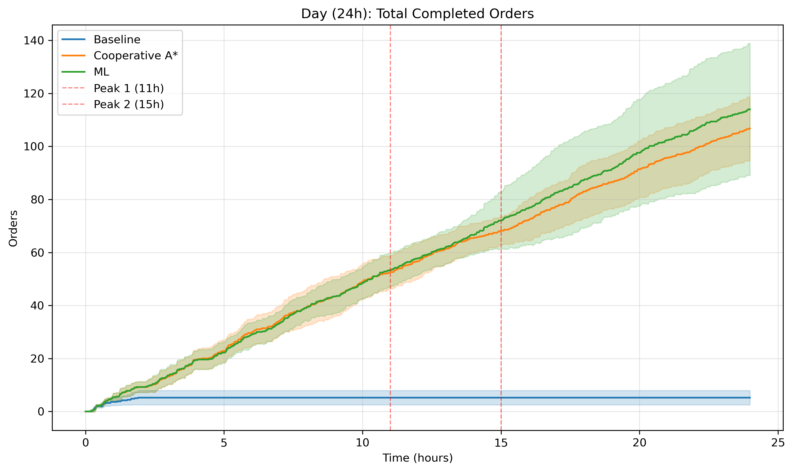
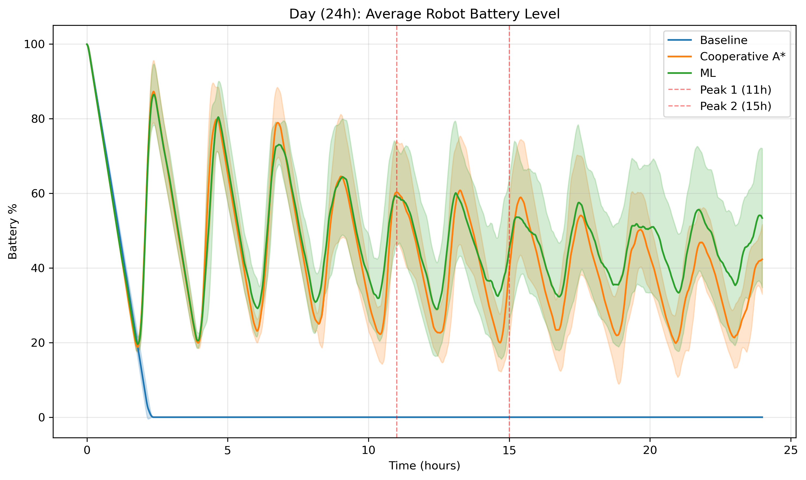

# Problem 3: Warehouse Robot Coordination 🤖

## Setup & Run the Code
### Setting up the environment 
An `environment.yml` is provided with a full breakdown of required packages. This can be installed using Mamba or Conda:  
```bash
conda env create -f environment.yml #conda 
mamba env create -f environment.yml #mamba
```
If neither Mamba nor Conda is available, a `requirements.txt` is also provided which can be installed via *pip*:  
```bash
pip install -r requirements.txt
```

### Benchmark all Implementations
To run all benchmarks for the daily, weekly and monthly setting, you can make use of the `main.py` file which will run all of the implemented benchmarks, average them over 5 seeds, and plot all the corresponding results with error bars shaded (figs are saved in `/figs`). 
```bash
python main.py
```

### Run Individual Implementations (This is where our contributions, algorithms and improvements are)
Each implementation can be run on its own, using the commands:
```bash
python -m src.warehouse_simulator #runs the basic benchmark 
python -m src.warehouse_simulator_ML #runs the ML benchmark 
```

### Visualise all Implementations
If you would like to watch the robots over the course of a day for both implementations, you can make use of the `visualise_warehouse.py` file. This will open a matplotlib window showing you the robots acting in real time. It will also save a gif to the `/figs` directory. Run it with:
```bash
python visualise_warehouse.py
```

### Customising runs
For both of the above configurations, the problem setting parameters can be modified in the `src/config.py` file, here you can specify things like warehouse size, num robots, etc. All benchmark files will use this config. 

### Checking ML model performance 
If you would like to run the data exploration and analysis, with evaluation on our chosen models please see the notebook `inspect_data.ipynb`. This cant be run from terminal or bash and will need to be run with a Jupyter environment setup. 

## Environment and Data Setup Used
 - I use the given starter code to implement the environment but make several changes. 
 - I first update the code to make use of the Poisson distribution provided in `src/synthetic_data.py` to generate more realistic order data scenarios compared to the given random 10% orders. Here I use the config outlined in `src/config.py` (such as having a peak at 8, and 5), and then having a peak multiplier of 4. 
 - Our warehouse is 20x20, with chargers in the centre, and a dock on the middle of each side (so 4 chargers and 4 docks total.)
 - I deploy 10 robots in the warehouse 
 - Shelves are placed in a grid like pattern with some extra shelves added to add obstacles and congestion in the top left. 
 - Certain shelves are favoured depending on our sampling seed (they are not randomly sampled when creating an order). This is static and doesnt change. This means certain shelves are used more than others
 - Order priority is assigned with priorities : 70% for normal, 20% for high, and 10% for urgent.
 - I train our models in the online setting (as they are acting and delivering) due to the nature of these robot warehouses in real life. They operate in such a dynamic and changing space that, to me, training on an offline dataset seems limiting. While more expensive it does allow us to adapt. 


## The Approaches Used 
### Baseline (A* and Greedy Assigning)
 - This is the baseline (control group) setup (naive and greedy). 
 - **Task Assignment:** Here I use the given first come first serve greedy approach (included in the code example). Orders are simply assigned to the nearest un-occupied robot. 
 - **Pathfinding:** I use a standard A* approach on a static grid, where our heuristic uses the Manhattan distance formulation. 
 - **Collision Handling:** I use a reactive collision setting, robots are moving blindly since they do not look into the future, so if they encounter another robot infront of them they simply wait until they can move forward. 
 - **Order Priority:** Before assigning orders in the greedy setting, orders are sorted by priority (urgent first) and then they are assigned. 
 - **Battery Management:** Simple state checking, if a robot is idle with less battery than the given threshold, it goes to charge.  

### Improvement 1 (Cooperative A* and Hungarian Matching) : 
 - Improvement over the baseline using an improved A* and better task assignment 
 - **Task Assignment:** Here instead of assigning orders one by one, I batch the pending orders and idle robots. I then construct a cost matrix based on each robots Manhattan distance to the order (where each cost C_ij is the distance from the robot i to order j). I then make use of *scipy.optimize.linear_sum_assignment* to implement the Hungarian matching (it finds the global minimum matching between orders and robots all at once using this cost matrix I construct). 
 - **Pathfinding:** Here I implement Prioritised Planning using space time A*: I implement time as a dimension when planning by making use of a reservation table. When a robot plans (I plan robot one by one), it reserves its path in time (for example it will reserve cell (1, 2) at time t=2, which is 2 steps in the future). Robots planning after this robot will then treat these reserved cells as dynamic obstacles. This means that if Robot A reserves cell  (1, 2) at time t=2, robot B knows that cell will be free at t=3. 
 - **Collision Handling:** If a robot spends more than 5 steps waiting (such as there being a cluster of robots around), it then picks a random neighbour to move to in hopes that the path finding will succeed from there.  
 - **Order Priority:** When constructing the cost matrix in the *task assignment* function, I first get the distance from robot to order but while giving urgent priority orders a smaller or negative cost to prioritise them. This is done by subtracting 100 for urgent, 50 for high and 0 for normal. This causes robots to be assigned to the urgent and high orders before the normal orders as they have a much smaller cost. 
 - **Battery Management:** I use a dynamic multi threshold system. A threshold of 25% overrides all tasks to force charging immediately. An opportunity threshold (dynamic between 40-80% based on ML load prediction) allows idle robots to charge up during quiet periods.
 - **Dock Management:** I implemented a specific heuristic to force idle robots to leave the docks immediately after delivery as I noticed they would sit there when they went idle, congesting the system. 


### Improvement 2 (Random Forest, Exponential Smoothing) : 
 - My more sustainable appraoch designed to minimise energy cost per order so robots dont go flat, improving total throughput. Here, the path finding and task assignment is mainly the same idea as we discuss in imporevement 1 from above. However, I modify it to accomodate new ML techniques:
 - **Firstly, for the Temporal Model (Demand Volume):**
   -  Here I use a Random Forest Regressor from SKLearn. I train this on live data as I recieve it in the simulation. 
   - The features I use for prediction are : `Hour of the Day`, `Day of the Week`, `Previous Hour's Order Volume` (lag feature). I also added on cyclical features by taking the Sin and Cos of hour of day.  
   - This model is trained to predict the next hours order volume given the current history. I note that the model starts training after a day of simulation, so it is fully online and adaptive, and requires no pre training. 
- **Secondly, the Spatial Model (Hotspot Tracking):**
   - Due to our environment setup, where some shelves are busier than others, I implement hotspot tracking
   - I keep a frequency map of each position in the map, and track how many times it is visited. I apply an exponential decay incase different groupins of shelves are favoured on different times / days to adapt to shifting demand trends (ie if some shelves are used more on Monday vs Wednesday). 

- **How are these models implemented and used:** 
   - Every 60 minutes in the environment, I feed the current times and constructed features into our temporal model. That model will tell us how busy I will be in the next hour. I use this info to first check, is the predicted volume greater than a pre-defined threshold? If yes, then I can trigger a pre certain events: 
      1. Here I force the battery threshold down to 30% (I dont want robots charging when I get an influx of orders) in order to meet demand. 
      2. I also move robots to hotspot regions (these are shelves used most often based on the current frequency map). Here I look at idle robots with battery that is atleast 10% above the threshold. I then spread robots evenly across the top 5 shelf hotspots (I scan a 7x7 area around the active shelf to find the closest valid cell). If no hotspots or available spots exist, the robot goes to the middle of the warehouse. 
   - If the temporal model predicts a load below the threshold then I can perform other logic:
     1. In this case, I set our robots battery threshold to 60% which makes them all recharge to be ready for the next high load period. 
     2. I still make sure orders are completed using the original logic from the improved appraoach. 

 - **How did I decide on a Random Forest Regressor:**
   - I would have liked to implement an LSTM as it is the time series model that I have the most experience with from my masters. However, I know that generally LSTMs require quite a bit of data and are less explainable than Random Forests. 
   - The random forest was the simplest model I know of that is a quick implementation. Due to the time constraints, this was the fasest approach without requiring too much research and it worked quite well (as evident in the notebook where we look at predictions vs actual). 

 - **How did I decide on Hotspot Prediction and Exponential Smoothing**
   - Since we are in a discerete small environment, it doesnt make sense to train and use a clustering approach as we can easily represent 20x20 bins. 
   - So we use a heatmap approach instead of a machine learning approach here as it is simpler to epxlain and understand. As for the exponential smoothing, my initial idea was to have the shelves change which are the hotspots over various days of the week. I did not have time to implement the changing shelf logic, but did still include the exponential decay which allows us to forget old data that may no longer be relevant. 

## Summary of Results
Resutls shown in the table below reflect the accumulated metrics at the end of 1 week of running the simulation. The best seed (seed 3) is chosen for the below results. Please refer to the slides or the figures in the `/fig` folder for a full averaged comparison between implementations (averaged over 5 seeds) with error regions included.

| Metric Category | Specific Metric | Baseline | ML (mine) |
| :--- | :--- | :--- | :--- |
| **Order Metrics** | Total Completed | 164.0 | **2538.0** |
| | Pending Orders | 343.9 | **4.7** |
| **Completion Times** | Average (All) | **22.75** | 26.17 |
| | Average (Normal) | 21.93 | 28.60 |
| | Average (High) | 25.36 | **20.72** |
| | Average (Urgent) | 21.96 | **20.77** |
| **Order Counts** | Normal | 97 | **1756** |
| | High | 39 | **502** |
| | Urgent | 28 | **280** |
| **Coordination** | Coordination Overhead | 0.9062 | **0.0012** |
| | Total Wait Steps | 31,652.0 | **101.0** |
| | Total Move Steps | 3,278.0 | **87,389.0** |
| **Battery Metrics** | Average Battery | 0.00% | **82.32%** |
| | Minimum Battery | 0.00% | **67.77%** |

In general, we see the improved ML model completed about 15 times more orders than the baseline (far more than a 30% improvement). The baseline suffered major gridlock, where much of the time was spend waiting for a clear path. This is solved and overcome by our cooperative space time A* implementation. We also see the battery management of our improved approach is much better than the baseline, with none of our robots ever going flat all while maintining a very high average charge. 




## Future Work and Ideas
Given the time constraint, there were several avenues I did not explore that I would have liked to, such as:
 - Hotspot shelves changing depending on the day of the week (our implementation generates hotspot shelves once and keeps them like that throughout)
 - Multi agent reinforcement learning as a benchmark against our ML solution as here the agent would be solely responsible for learning the best techniques to be efficient. Reward function design could be : positive rewards for each order (scaled by the priority), vs negative rewards for batteries going flat. 
 - Trying different models out for the temporal aspect, random forest was a known safe bet. 
 - I would have liked to use an LSTM, but that requires a lot more data than a random forest and more training time on a CPU only machine. 

## Limitations
 - **Algorithmic scalability:** Currently my approach has a computational complexity worry. As the number of robots (R) and orders (O) scale, the hungarian algorithm (known to be O(R^3)) along with A* will become too computationally expensive to use 
 - **Cooperative Space Time Planning:** The Cooperative A* plans robot by robot. There is a chance that the first robots plan blocks the other robots until it is done planning leading to a huge inneficiency. 
 - **Online Setting:** We operate our improved model in the online setting, which means the model only starts training after the first few hours. Before then it is just guessing and could make mistakes that could lock the algorithm up. 

## References
 - https://nyobolt.com/resources/blog/how-warehouse-robots-are-running-non-stop-the-reality-of-24-7-operations/#:~:text=Battery%20Runtime%20vs.&text=Smart%20energy%20management%20systems%20balance,infrastructure%20costs%20low%20%5B18%5D. 
 - https://mlpills.substack.com/p/issue-89-encoding-cyclical-features 
 - https://docs.scipy.org/doc/scipy/reference/generated/scipy.optimize.linear_sum_assignment.html 
 - https://towardsdatascience.com/how-to-handle-cyclical-data-in-machine-learning-3e0336f7f97c/
 - Google Gemini (visualisation and averaging code) and Nano Banana (images in slides)
